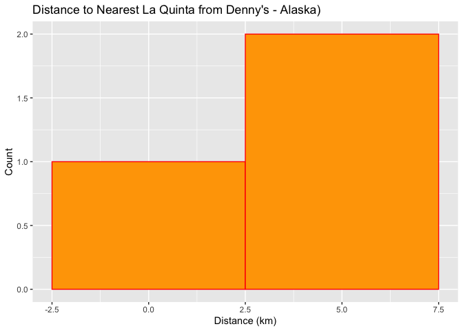
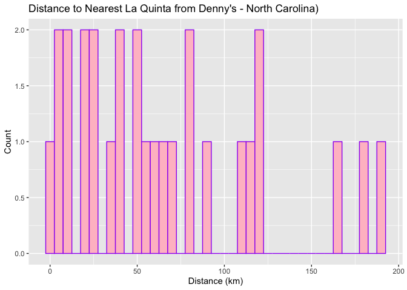
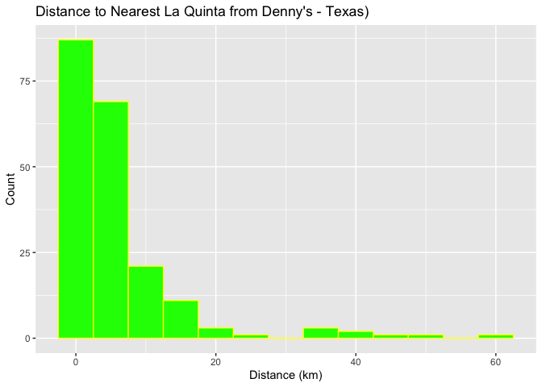
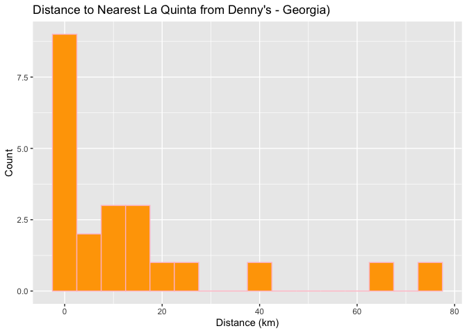

Lab 05 - La Quinta is Spanish for next to Denny’s, Pt. 2
================
Shatavia Bellmon
2/23/26

### Load packages and data

``` r
library(tidyverse) 
library(readr) 
```

``` r
states <- read_csv("data/states.csv")
dennys <- read_csv("data/dennys.csv")
laquinta <- read_csv("data/laquinta.csv")
```

### Exercise 1

``` r
dn <- dennys
```

``` r
dn_ak <- dn %>%
  filter(state == "AK")
nrow(dn_ak)
```

    ## [1] 3

There are three Denny’s in Alaska.

``` r
lq <- laquinta
```

``` r
lq_ak <- lq %>%
  filter(state == "AK")
nrow(lq_ak)
```

    ## [1] 2

There are two Laquintas in Alaska.

### Exercise 2

``` r
num_parings <- nrow(dn_ak) * nrow((lq_ak))
```

There needs to be 6 parings.

### Exercise 3

``` r
dn_lq_ak <- full_join(dn_ak, lq_ak,
  by = "state"
)
```

    ## Warning in full_join(dn_ak, lq_ak, by = "state"): Detected an unexpected many-to-many relationship between `x` and `y`.
    ## ℹ Row 1 of `x` matches multiple rows in `y`.
    ## ℹ Row 1 of `y` matches multiple rows in `x`.
    ## ℹ If a many-to-many relationship is expected, set `relationship =
    ##   "many-to-many"` to silence this warning.

``` r
dn_lq_ak
```

    ## # A tibble: 6 × 11
    ##   address.x     city.x state zip.x longitude.x latitude.x address.y city.y zip.y
    ##   <chr>         <chr>  <chr> <chr>       <dbl>      <dbl> <chr>     <chr>  <chr>
    ## 1 2900 Denali   Ancho… AK    99503       -150.       61.2 3501 Min… Ancho… 99503
    ## 2 2900 Denali   Ancho… AK    99503       -150.       61.2 4920 Dal… Fairb… 99709
    ## 3 3850 Debarr … Ancho… AK    99508       -150.       61.2 3501 Min… Ancho… 99503
    ## 4 3850 Debarr … Ancho… AK    99508       -150.       61.2 4920 Dal… Fairb… 99709
    ## 5 1929 Airport… Fairb… AK    99701       -148.       64.8 3501 Min… Ancho… 99503
    ## 6 1929 Airport… Fairb… AK    99701       -148.       64.8 4920 Dal… Fairb… 99709
    ## # ℹ 2 more variables: longitude.y <dbl>, latitude.y <dbl>

### Exercise 4

View(dn_lq_ak)

There are six observations in the dn_lq_ak data frame. The variables in
this data frame are address.x, city.x, state, zip.x, longitude.x,
latitude.x, address.y, city.y, zip.y, longitude.y, and latitude.y.

### Exercise 5

``` r
haversine <- function(long1, lat1, long2, lat2, round = 3) {
  # convert to radians
  long1 <- long1 * pi / 180
  lat1 <- lat1 * pi / 180
  long2 <- long2 * pi / 180
  lat2 <- lat2 * pi / 180

  R <- 6371 # Earth mean radius in km

  a <- sin((lat2 - lat1) / 2)^2 + cos(lat1) * cos(lat2) * sin((long2 - long1) / 2)^2
  d <- R * 2 * asin(sqrt(a))

  return(round(d, round)) # distance in km
}
```

### Exercise 6

``` r
dn_lq_ak <- dn_lq_ak %>%
  mutate(distance = haversine(longitude.x, latitude.x, longitude.y, latitude.y))
```

### Exercise 7

``` r
dn_lq_ak_min <- dn_lq_ak %>%
  group_by(address.x) %>%
  summarize(closest_distance = min(distance))
```

### Exercise 8

``` r
summary(dn_lq_ak_min$closest_distance)
```

    ##    Min. 1st Qu.  Median    Mean 3rd Qu.    Max. 
    ##   2.035   3.616   5.197   4.410   5.598   5.998

``` r
ggplot(dn_lq_ak_min, aes(x = closest_distance)) +
  geom_histogram(binwidth = 5, fill = "orange", color = "red") +
  labs(title = "Distance to Nearest La Quinta from Denny's - Alaska)", 
       x = "Distance (km)", y = "Count")
```

<!-- -->

The distribution of distances between Denny’s and the nearest La Quinta
in Alaska is left skewed indicating a higher concentration of distances
near the maximum value.

View(dn_lq_ak)

### Exercise 9 - NC

View(dennys)

View(laquinta)

``` r
dn_nc <- dn %>%
  filter(state == "NC")
nrow(dn_nc)
```

    ## [1] 28

``` r
lq_nc <- lq %>%
  filter(state == "NC")
nrow(lq_nc)
```

    ## [1] 12

``` r
num_parings <- nrow(dn_nc) * nrow((lq_nc))
```

``` r
dn_lq_nc <- full_join(dn_nc, lq_nc,
  by = "state"
)
```

    ## Warning in full_join(dn_nc, lq_nc, by = "state"): Detected an unexpected many-to-many relationship between `x` and `y`.
    ## ℹ Row 1 of `x` matches multiple rows in `y`.
    ## ℹ Row 1 of `y` matches multiple rows in `x`.
    ## ℹ If a many-to-many relationship is expected, set `relationship =
    ##   "many-to-many"` to silence this warning.

``` r
dn_lq_nc
```

    ## # A tibble: 336 × 11
    ##    address.x    city.x state zip.x longitude.x latitude.x address.y city.y zip.y
    ##    <chr>        <chr>  <chr> <chr>       <dbl>      <dbl> <chr>     <chr>  <chr>
    ##  1 1 Regent Pa… Ashev… NC    28806       -82.6       35.6 165 Hwy … Boone  28607
    ##  2 1 Regent Pa… Ashev… NC    28806       -82.6       35.6 3127 Slo… Charl… 28208
    ##  3 1 Regent Pa… Ashev… NC    28806       -82.6       35.6 4900 Sou… Charl… 28217
    ##  4 1 Regent Pa… Ashev… NC    28806       -82.6       35.6 4414 Dur… Durham 27707
    ##  5 1 Regent Pa… Ashev… NC    28806       -82.6       35.6 1910 Wes… Durham 27713
    ##  6 1 Regent Pa… Ashev… NC    28806       -82.6       35.6 1201 Lan… Green… 27407
    ##  7 1 Regent Pa… Ashev… NC    28806       -82.6       35.6 1607 Fai… Conov… 28613
    ##  8 1 Regent Pa… Ashev… NC    28806       -82.6       35.6 191 Cres… Cary   27518
    ##  9 1 Regent Pa… Ashev… NC    28806       -82.6       35.6 2211 Sum… Ralei… 27612
    ## 10 1 Regent Pa… Ashev… NC    28806       -82.6       35.6 1001 Aer… Morri… 27560
    ## # ℹ 326 more rows
    ## # ℹ 2 more variables: longitude.y <dbl>, latitude.y <dbl>

``` r
dn_lq_nc <- dn_lq_nc %>%
  mutate(distance = haversine(longitude.x, latitude.x, longitude.y, latitude.y))
```

``` r
dn_lq_nc_min <- dn_lq_nc %>%
  group_by(address.x) %>%
  summarize(closest_distance = min(distance))
```

``` r
summary(dn_lq_nc_min$closest_distance)
```

    ##    Min. 1st Qu.  Median    Mean 3rd Qu.    Max. 
    ##   1.779  22.388  53.456  65.444  93.985 187.935

``` r
ggplot(dn_lq_nc_min, aes(x = closest_distance)) +
  geom_histogram(binwidth = 5, fill = "pink", color = "purple") +
  labs(title = "Distance to Nearest La Quinta from Denny's - North Carolina)", 
       x = "Distance (km)", y = "Count")
```

<!-- -->

### Exercise 10 - Texas

``` r
dn_tx <- dn %>%
  filter(state == "TX")
nrow(dn_tx)
```

    ## [1] 200

``` r
lq_tx <- lq %>%
  filter(state == "TX")
nrow(lq_tx)
```

    ## [1] 237

``` r
num_parings <- nrow(dn_tx) * nrow((lq_tx))
```

``` r
dn_lq_tx <- full_join(dn_tx, lq_tx,
  by = "state"
)
```

    ## Warning in full_join(dn_tx, lq_tx, by = "state"): Detected an unexpected many-to-many relationship between `x` and `y`.
    ## ℹ Row 1 of `x` matches multiple rows in `y`.
    ## ℹ Row 1 of `y` matches multiple rows in `x`.
    ## ℹ If a many-to-many relationship is expected, set `relationship =
    ##   "many-to-many"` to silence this warning.

``` r
dn_lq_tx
```

    ## # A tibble: 47,400 × 11
    ##    address.x    city.x state zip.x longitude.x latitude.x address.y city.y zip.y
    ##    <chr>        <chr>  <chr> <chr>       <dbl>      <dbl> <chr>     <chr>  <chr>
    ##  1 120 East I-… Abile… TX    79601       -99.6       32.4 3018 Cat… Abile… 79606
    ##  2 120 East I-… Abile… TX    79601       -99.6       32.4 3501 Wes… Abile… 79601
    ##  3 120 East I-… Abile… TX    79601       -99.6       32.4 14925 La… Addis… 75254
    ##  4 120 East I-… Abile… TX    79601       -99.6       32.4 909 East… Alamo  78516
    ##  5 120 East I-… Abile… TX    79601       -99.6       32.4 2400 Eas… Alice  78332
    ##  6 120 East I-… Abile… TX    79601       -99.6       32.4 1220 Nor… Allen  75013
    ##  7 120 East I-… Abile… TX    79601       -99.6       32.4 1165 Hwy… Alvar… 76009
    ##  8 120 East I-… Abile… TX    79601       -99.6       32.4 880 Sout… Alvin  77511
    ##  9 120 East I-… Abile… TX    79601       -99.6       32.4 1708 Int… Amari… 79103
    ## 10 120 East I-… Abile… TX    79601       -99.6       32.4 9305 Eas… Amari… 79118
    ## # ℹ 47,390 more rows
    ## # ℹ 2 more variables: longitude.y <dbl>, latitude.y <dbl>

``` r
dn_lq_tx <- dn_lq_tx %>%
  mutate(distance = haversine(longitude.x, latitude.x, longitude.y, latitude.y))
```

``` r
dn_lq_tx_min <- dn_lq_tx %>%
  group_by(address.x) %>%
  summarize(closest_distance = min(distance))
```

``` r
summary(dn_lq_tx_min$closest_distance)
```

    ##    Min. 1st Qu.  Median    Mean 3rd Qu.    Max. 
    ##  0.0160  0.7305  3.3715  5.7918  6.6303 60.5820

``` r
ggplot(dn_lq_tx_min, aes(x = closest_distance)) +
  geom_histogram(binwidth = 5, fill = "green", color = "yellow") +
  labs(title = "Distance to Nearest La Quinta from Denny's - Texas)", 
       x = "Distance (km)", y = "Count")
```

<!-- -->

The distribution of distances between Denny’s and the nearest La Quinta
in Texas is right skewed indicating a higher concentration of distances
near the minimum value.

### Exercise 11 - Georgia

``` r
dn_ga <- dn %>%
  filter(state == "GA")
nrow(dn_ga)
```

    ## [1] 22

``` r
lq_ga <- lq %>%
  filter(state == "GA")
nrow(lq_ga)
```

    ## [1] 41

``` r
num_parings <- nrow(dn_ga) * nrow((lq_ga))
```

``` r
dn_lq_ga <- full_join(dn_ga, lq_ga,
  by = "state"
)
```

    ## Warning in full_join(dn_ga, lq_ga, by = "state"): Detected an unexpected many-to-many relationship between `x` and `y`.
    ## ℹ Row 1 of `x` matches multiple rows in `y`.
    ## ℹ Row 1 of `y` matches multiple rows in `x`.
    ## ℹ If a many-to-many relationship is expected, set `relationship =
    ##   "many-to-many"` to silence this warning.

``` r
dn_lq_ga
```

    ## # A tibble: 902 × 11
    ##    address.x    city.x state zip.x longitude.x latitude.x address.y city.y zip.y
    ##    <chr>        <chr>  <chr> <chr>       <dbl>      <dbl> <chr>     <chr>  <chr>
    ##  1 3026 Washin… Augus… GA    30907       -82.0       33.5 184 Nort… Acwor… 30102
    ##  2 3026 Washin… Augus… GA    30907       -82.0       33.5 1200 Vir… Atlan… 30344
    ##  3 3026 Washin… Augus… GA    30907       -82.0       33.5 4820 Mas… Atlan… 30337
    ##  4 3026 Washin… Augus… GA    30907       -82.0       33.5 1350 Nor… Alpha… 30022
    ##  5 3026 Washin… Augus… GA    30907       -82.0       33.5 1184 Dog… Conye… 30012
    ##  6 3026 Washin… Augus… GA    30907       -82.0       33.5 1000 Lin… Dougl… 30134
    ##  7 3026 Washin… Augus… GA    30907       -82.0       33.5 2370 Ste… Duluth 30096
    ##  8 3026 Washin… Augus… GA    30907       -82.0       33.5 2535 Cha… Atlan… 30324
    ##  9 3026 Washin… Augus… GA    30907       -82.0       33.5 2415 Pac… Atlan… 30339
    ## 10 3026 Washin… Augus… GA    30907       -82.0       33.5 6260 Pea… Atlan… 30328
    ## # ℹ 892 more rows
    ## # ℹ 2 more variables: longitude.y <dbl>, latitude.y <dbl>

``` r
dn_lq_ga <- dn_lq_ga %>%
  mutate(distance = haversine(longitude.x, latitude.x, longitude.y, latitude.y))
```

``` r
dn_lq_ga_min <- dn_lq_ga %>%
  group_by(address.x) %>%
  summarize(closest_distance = min(distance))
```

``` r
summary(dn_lq_ga_min$closest_distance)
```

    ##    Min. 1st Qu.  Median    Mean 3rd Qu.    Max. 
    ##  0.0240  0.6777  7.7065 14.0458 13.8810 73.1200

``` r
ggplot(dn_lq_ga_min, aes(x = closest_distance)) +
  geom_histogram(binwidth = 5, fill = "orange", color = "pink") +
  labs(title = "Distance to Nearest La Quinta from Denny's - Georgia)", 
       x = "Distance (km)", y = "Count")
```

<!-- -->

The distribution of distances between Denny’s and the nearest La Quinta
in Georgia is right skewed indicating a higher concentration of
distances near the minimum value.

### Exercise 12

Mitch Hedberg’s joke held true for the state of Texas because they have
the greatest amount of Dennys and La Quintas with a short distance
between them.
